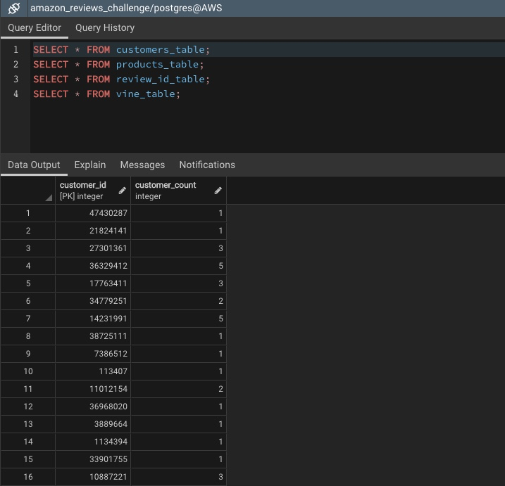
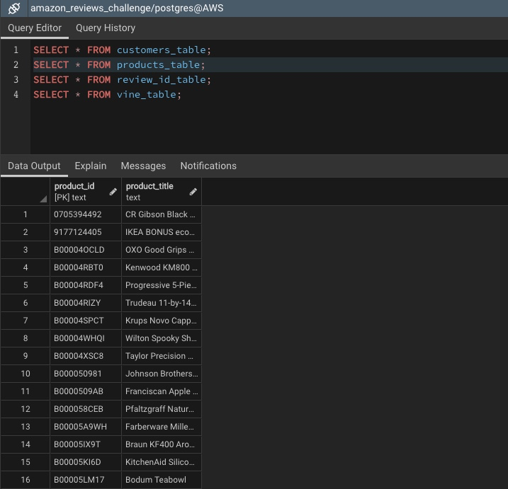
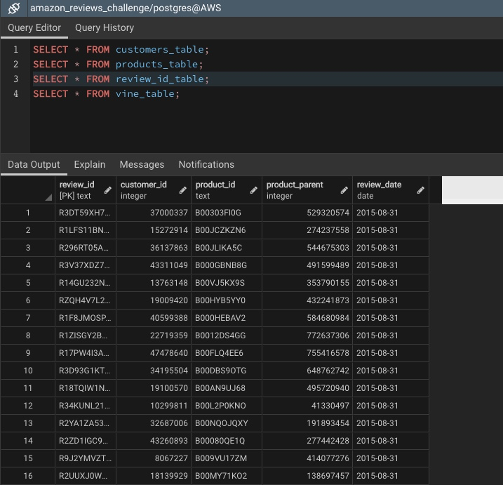
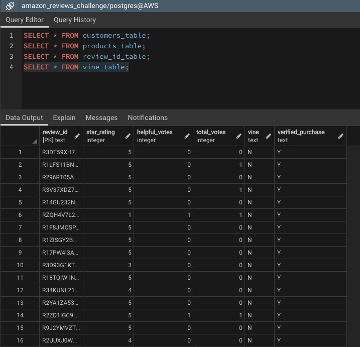
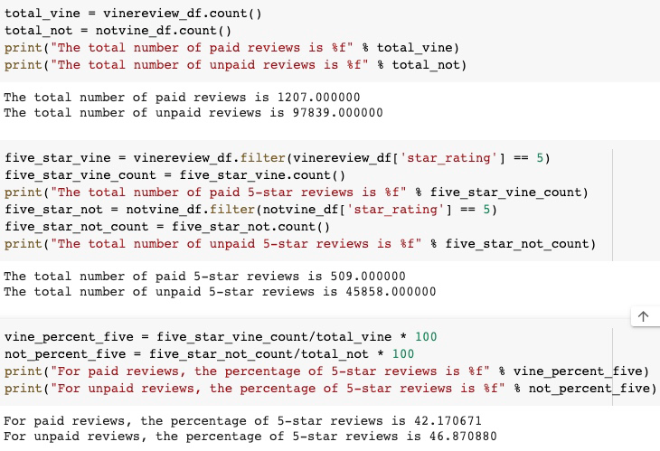

# Amazon_Vine_Analysis
## Overview
The purpose of the included analysis is to further explore trends in user reviews for kitchen items based on certain factors (number of reviews by customer, date of reviews, items reviewed as part of Vine program) by creating tables in a database.

Customer/Number of Reviews:

Products included:

Review/Date:

Vine program reviews:

Reviews were further organized to compare Vine program reviews versus unpaid user reviews of products - specifically 5-star reviews. 

## Results
- In total, the kitchen items included 1,207 paid/Vine reviews and 97,839 unpaid/non-Vine reviews.
- Of the Vine reviews, 509 were 5-star ratings. Of the non-Vine reviews, 45,858 were 5-star ratings. 
- 42% of Vine reviews were 5-stars while 47% of non-Vine reviews were 5-stars. 

## Summary
Based on the percentage of 5-star reviews, non-Vine users provide a greater percentage 5-star ratings than Vine users - so there is no positivity bias in the Vine program. 
Additional analysis could include a distribution of star ratings for products with largest number of reviews - one distribution for Vine users and one for non-Vine users. 
